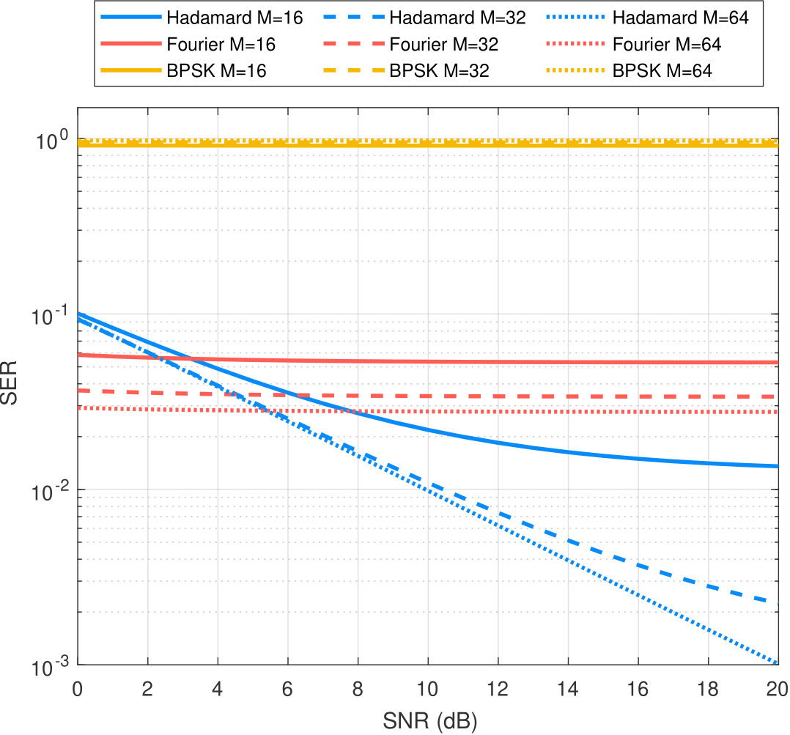
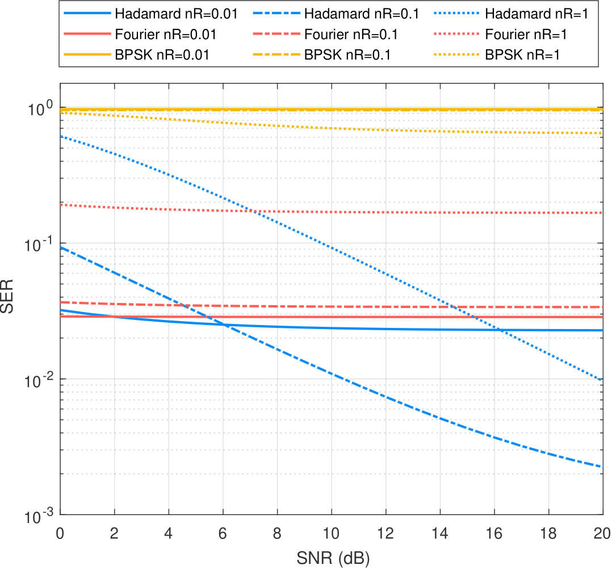
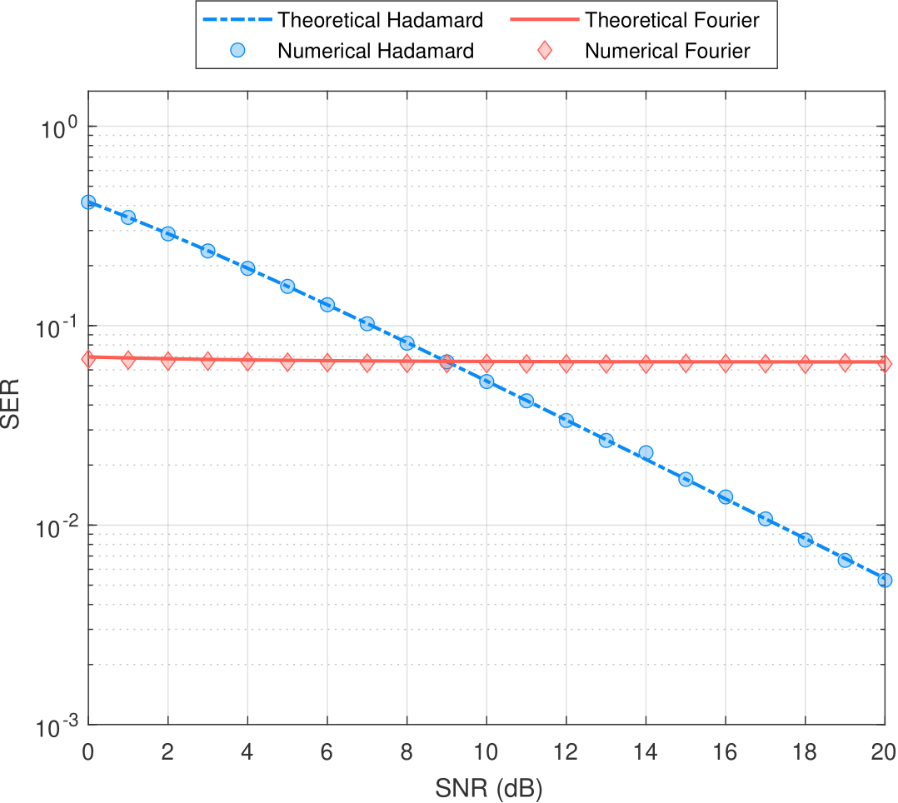

# Superadditive Optical Quantum Communications

## Overview
This project explores the theoretical foundations and challenges of integrating quantum superadditive technologies into existing optical networks, evaluating their performance in a noisy channel. The implementation is based on the concepts discussed in the paper "Perspectives on Superadditive Optical Quantum Communications" by Gabriella Cincotti, Marco Napoleone, and Matteo Rosati.

## Key Concepts
1. **Superadditive Quantum Communications**: Utilizes joint detection receivers (JDR) to enhance system capacity beyond classical limits.
2. **Hadamard machine (Green machine)**: Structured optical receivers using Hadamard codewords to improve spectral efficiency.
3. **Fourier machine**: Novel JDR based on Fourier codes, offering advantages in low-power optical settings.

## Implementation Details
- **Languages**: MATLAB
- **Frameworks**: None

## Project Structure
- `Main/`: Contains the source code for the implementation.
- `MonteCarlo/`: Monte Carlo class for simulating the performance of the system.
- `Hadamard/`: Implementation of the Hadamard codes.
- `OOK/`: Implementation of the on-off keying modulation.
- `README.md`: Project documentation.

## Results
The project evaluates the performance of the superadditive quantum communication system in a noisy channel, comparing the Hadamard and Fourier machines.
## Results
The project evaluates the performance of the superadditive quantum communication system in a noisy channel, comparing the Hadamard and Fourier machines.

### Performance Evaluation
Below are the results of the Bit Error Rate (BER) versus Signal-to-Noise Ratio (SNR) for different configurations:

## Contact
For any questions or issues, please contact Gabriella Cincotti at gabriella.cincotti@uniroma3.it.